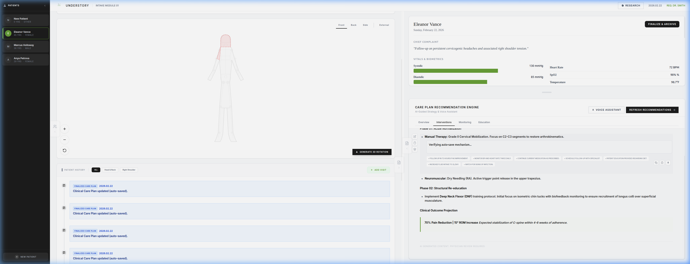

# Understory

> Insight beneath the surface.


> **Note:** This application was created for the purposes of entering the Gemini Live Agent Challenge hackathon.



Understory streamlines patient intake with an interactive 3D body map and AI-powered clinical intelligence. It empowers practitioners with rapid data visualization and strategy synthesis for proactive care decisions.

**#GeminiLiveAgentChallenge**

---

## Core Features

-   **Care Plan Recommendation Engine:** A professional clinical analysis engine that synthesizes structured strategies for patient care, organized by diagnostic lenses (Overview, Interventions, Monitoring, Education).
-   **Multi-Agent Orchestration:** Powered by `@google/adk`, coordinating specialized `LlmAgent` experts to synthesize complex clinical data into actionable insights with stable streaming.
-   **Printable Clinical Stationery:** CSS Grid-optimized, multi-page physical printouts featuring Halftone body maps for visual pain hotspot diagnosis, with user-selectable toggles for clinical summaries and history.
-   **Minimalist Dieter Rams Design:** A premium, minimalist UI inspired by the principles of Dieter Rams—prioritizing clarity, neutrality, functional excellence, and seamless mobile responsive layouts (`100dvh`).
-   **Smartwatch & Mobile Optimization:** Responsive UI scaling down to extremely constrained viewports (e.g., Pixel Watch 2 at 286px width) for ultra-portable clinical referencing.
-   **Interactive 3D Body Mapping:** Precise anatomical selection using a Three.js-powered skeletal and surface model for localized clinical notation.
-   **Box Breathing UX:** Focused 16-second box breathing visual animations integrated into primary intake text areas and interactive cursors to promote practitioner mindfulness.
-   **Interactive Task Bracketing:** Rapidly markup generated care plans using a double-click state machine (Normal, Added, Removed) to vet and customize AI recommendations.
-   **FHIR-Standard Data Portability:** Seamless import and export of patient data using the FHIR Bundle standard, featuring Unicode-safe Base64 encoding for complete data integrity.
-   **Patient Management System:** Full CRUD capabilities for patient records, including historical visit review and permanent record removal.
-   **Live AI Consult:** A voice-enabled, conversational co-pilot that collaborates with clinicians to refine strategy in real-time.
-   **Localized Auto-Save:** Real-time persistence of clinical notes and bracket states with visual "Saving..." and "Saved ✔" status indicators.

## Architecture

The application follows a modern, reactive architecture using Angular Signals and the Google Gemini API.

```mermaid
graph TD
    User[Doctor/User] -->|HTTPS| CloudRun[Google Cloud Run Hosting]
    CloudRun -->|Serves| UI[Angular Frontend]
    CloudRun -->|Hosts| Backend[Express.js Server]
    
    subgraph "Clinical Data Layer"
        UI -->|Selects Body Part| BodyMap[BodyViewer Component]
        UI -->|Enters Data| Intake[IntakeForm Component]
        UI -->|Requests Analysis| Analysis[Analysis Component]
        UI -->|Dictates Notes| Dictation[Dictation Service]
        
        BodyMap -->|Updates| State[PatientState Service]
        Intake -->|Updates| State
        Dictation -->|Updates| Intake
        
        State -->|Uses Centralized Types| Types[patient.types.ts]
        Analysis -->|Reads| State
        Analysis -->|Invokes| AdkRunner[ADK InMemoryRunner]
    end

    subgraph "Persistence & Portability"
        State -->|Persists| PM[Patient Management]
        PM -->|Exports/Imports| FHIR[FHIR Bundle / PDF]
    end
    
    subgraph "AI Core & Integrations"
        AdkRunner -->|Orchestrates| Agents[Specialized LlmAgents]
        Agents -->|Generate Content| Flash[Gemini 2.5 Flash]
        Backend -->|Proxy Request| PubMedProxy[/api/pubmed Endpoint]
        Backend -->|Static Serve| GoogleSearch[search.html]
        PubMedProxy -->|E-utilities API| NCBI[NCBI PubMed]
        GoogleSearch -->|CSE API| Google[Google Programmable Search]
    end
    
    UI -->|Iframe Message| GoogleSearch
    UI -->|API Call| PubMedProxy
    Flash -->|Returns Partial JSON| Agents
    Agents -->|Streams JSON| AdkRunner
    AdkRunner -->|Yields Chunks| Analysis
    NCBI -->|XML to JSON| PubMedProxy
    PubMedProxy -->|Search Results| UI
    Google -->|Search Results| GoogleSearch
    GoogleSearch -->|postMessage| UI
```

## Tech Stack

-   **Framework:** Angular v21.1 (Signals-based, Zoneless)
-   **Architecture:** Angular Server-Side Rendering (SSR) & Client-Side Hydration
-   **Visualization:** Three.js (3D Anatomical Modeling)
-   **Intelligence:** Google GenAI SDK (`gemini-2.5-flash`) & Google Agent Development Kit (`@google/adk`)
-   **Research Integrations:** Google Programmable Search Engine (CSE) & NIH PubMed E-utilities
-   **Export Engine:** jsPDF & FHIR Bundle standard
-   **Styling:** Tailwind CSS & Dieter Rams Design System
-   **Speech Control:** Web Speech API (Bi-directional voice interaction)

## Kaizen Philosophy

Understory is built on the **Kaizen** principle of *continuous, incremental improvement*. We believe that clinical tools should never be "finished," but rather evolve alongside the practitioners who use them.

-   **Incremental Intelligence**: Every clinical analysis is a baseline for refinement. We use interactive bracketing to allow doctors to continuously improve the AI's output.
-   **Iterative Design**: Our UI is constantly polished to reduce cognitive load, ensuring that every pixel serves a clinical purpose.
-   **Evolving Integration**: We prioritize high-integrity manual data handling today while continuously building the bridges for automated, high-privacy biometric telemetry tomorrow.

## Getting Started

To run this project in a local development environment:

1.  **Clone the repository:**
    ```bash
    git clone https://github.com/philgear/understory.git
    ```

2.  **Install dependencies:**
    ```bash
    npm install
    ```

3.  **Run the development server:**
    ```bash
    npm run dev
    ```

4.  **Preview Production Build:**
    ```bash
    npm run preview
    ```

## Personal Learning Commitment

Reflecting on the development of Understory, my commitment is to continuously embrace the complexity of multi-agent architectures and rigorous frontend performance optimization. Building this platform taught me the profound importance of balancing bleeding-edge AI orchestration—like implementing `@google/adk`'s `InMemoryRunner` to stabilize clinical generations—with the strict UX demands of a modern progressive web application. I commit to changing how I approach state management in future projects by prioritizing granular, reactive UI signals from day one, and to never settle for "good enough" when a top-tier mobile performance score (100/100 Lighthouse) is attainable through diligent layout unblocking and dynamic asset loading. Further, this project deepened my respect for CSS—from mastering viewport units (`100dvh`) to restore native scrolling on complex mobile constraints, to implementing robust `@media print` rules for structured offline clinical stationery.

## Data Card

Understanding how clinical information flows through Understory is critical for building practitioner trust.

**Data Type & Processing:**
Understory operates as a localized Clinical Data processor. It does not train core foundation models on user data. The primary data inputs include:
- **Patient Intake:** Demographics, chief complaints, and historical medical notes entered manually or via Web Speech recognition.
- **Biometric Selection:** Anatomical regions pinpointed interactively via the 3D body map viewer.
- **Vitals & Telemetry:** Standard health metrics (Heart rate, Blood pressure, SpO2).

**Data Storage & Privacy:**
- **Local Persistence:** All patient states, clinical brackets, and historical visit notes are stored strictly within the client's local session.
- **No Remote Database:** There is no centralized remote database storing persistent patient records. 
- **AI Processing:** Selected clinical context is transmitted securely to the Gemini API (`gemini-2.5-flash`) and specialized `@google/adk` agent orchestrators via transient inference requests. The data is used solely for the immediate generation of the clinical summary and is intentionally not retained by the application backend for training.

**Data Export & Portability:**
- **FHIR Bundles:** Users can export explicit JSON blobs representing standard FHIR patient state formats, encouraging open data portability.
- **Printable Stationery:** Generated insights can be physically printed via CSS-optimized layouts featuring Halftone diagnostic maps, ensuring sensitive records can be kept strictly on offline paper when required.

## Impact Statement

### Societal Impact Statement: Understory & AI-Augmented Clinical Strategy

**Overview**  
Understory is designed to transform the initial clinical encounter by shifting the burden of data synthesis from the physician to an AI-augmented workflow. By evolving generic medical analysis into a "Care Plan Recommendation Engine," the platform aims to reclaim clinical time for direct patient interaction, ultimately strengthening the doctor-patient relationship through increased presence and empathy.

**Societal and Ethical Implications**  
- **Autonomy and Dignity**: The platform prioritizes physician autonomy by acting as a "Live Consult" co-pilot rather than an automated decision-maker. Interactive "Task Bracketing" ensures that every medical recommendation is manually vetted and adjusted by a human clinician.
- **Fairness and Community Well-being**: By streamlining complex data ingestion—vitals, history, and chief complaint—Understory reduces the cognitive load on healthcare providers, mitigating physician burnout.
- **Data Integrity**: The commitment to FHIR standards ensures that patient data remains portable, interoperable, and owned by the clinical institution, preventing proprietary data silos.

**Environmental Impact**  
By facilitating rapid, data-driven synthesis in a paperless environment, Understory promotes resource efficiency within clinics. The use of efficient models (Gemini Flash) ensures that the computational footprint remains optimized for sustainable growth.

## License

This project is licensed under the MIT License.