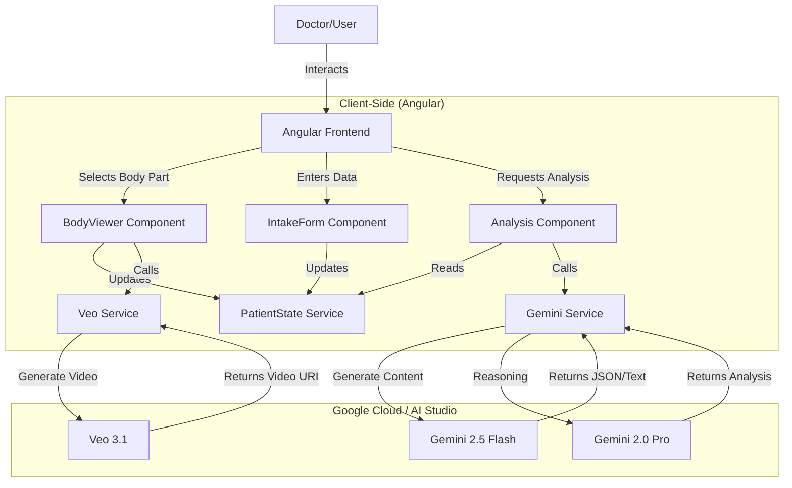

# Understory

> Insight beneath the surface.


> **Note:** This application was created for the purposes of entering the Gemini Live Agent Challenge hackathon.

Understory streamlines patient intake with an interactive body map and AI-powered insights. It empowers doctors with rapid data visualization and analysis for proactive care decisions.

This tool aims to accelerate the data-gathering process, allowing physicians to quickly visualize patient issues and leverage generative AI to explore potential connections and research avenues before ever speaking to the patient.

**#GeminiLiveAgentChallenge**

---

## Key Features

- **Interactive Body Map:** A clean, SVG-based human model for doctors to quickly select and log areas of concern.
- **High-Fidelity Anatomical Sprite Model:** Replaced the previous vector-based model with a detailed, high-resolution sprite sheet for improved visual quality and performance. The model dynamically adjusts to reflect patient-provided gender.
- **Dynamic Intake Forms:** Context-aware forms appear for selected body parts to log pain levels and symptoms.
- **AI-Powered Analysis:** With a single click, generate a detailed integrative care report based on all entered patient data, using the Gemini API.
- **Live AI Consult:** A voice-enabled, conversational overlay where doctors can speak directly with an AI assistant to ask follow-up questions about the patient's case.
- **Real-time & Responsive:** Built with Angular signals for a reactive UI that updates instantly as data is entered.
- **Modern UI/UX:** A minimalist, professional interface designed for clinical environments, built with Tailwind CSS.

## Architecture

The application follows a modern, reactive architecture using Angular Signals and the Google Gemini API.



## Powered By

This project leverages the following Google technologies:

-   [**Google Gemini API**](https://ai.google.dev/) - The core intelligence engine for patient analysis and report generation.
-   [**Google Veo**](https://deepmind.google/technologies/veo/) - Generative video model used to create 3D-style rotating medical visualizations from text prompts.
-   [**Angular**](https://angular.dev/) - The web framework used for the reactive, signal-based user interface.
-   [**Google AI Studio**](https://aistudio.google.com/) - The development platform used to build and prototype this agent.

## Tech Stack

- **Framework:** Angular (v18+, Standalone Components, Zoneless)
- **Styling:** Tailwind CSS
- **AI Integration:** 
  - `gemini-2.5-flash` (Fast data processing)
  - `gemini-2.0-pro-exp` (Complex medical reasoning)
  - `veo-3.1-fast-generate-preview` (3D Body Rotation Videos)
- **Speech:** Web Speech API (SpeechRecognition & SpeechSynthesis)

## Getting Started

To run this project in a local development environment, you would typically follow these steps:

1.  **Clone the repository:**
    ```bash
    git clone https://github.com/your-username/understory.git
    ```

2.  **Install dependencies:**
    ```bash
    npm install
    ```

3.  **Set up environment variables:**
    Create a `.env` file in the root directory and add your Gemini API key:
    ```
    API_KEY=your_gemini_api_key_here
    ```

4.  **Run the development server:**
    ```bash
    npm start
    ```

## License

This project is licensed under the MIT License - see the [LICENSE.md](LICENSE.md) file for details.