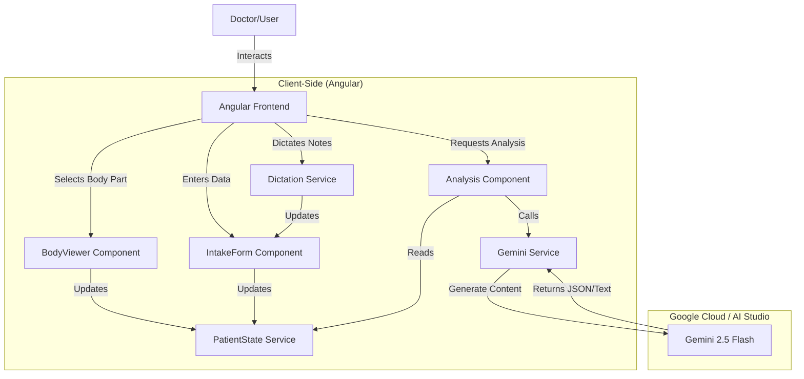

# Understory

> Insight beneath the surface.


> **Note:** This application was created for the purposes of entering the Gemini Live Agent Challenge hackathon.


Understory streamlines patient intake with an interactive body map and AI-powered insights. It empowers doctors with rapid data visualization and analysis for proactive care decisions.

This tool aims to accelerate the data-gathering process, allowing physicians to quickly visualize patient issues and leverage generative AI to explore potential connections and research avenues before ever speaking to the patient.

**#GeminiLiveAgentChallenge**

---

- **Care Plan Recommendation Engine:** Evolved clinical analysis that synthesizes structured strategies for patient care, organized by diagnostic lenses (Overview, Interventions, Monitoring, Education).
- **Interactive Task Bracketing:** Rapidly markup generated care plans using a double-click state machine (Normal, Added, Removed) to vet and customize AI recommendations.
- **Localized Auto-Save:** Real-time persistence of clinical notes and bracket states with visual "Saving..." and "Saved ✔" status indicators.
- **Live AI Consult:** A voice-enabled, conversational "Live Consult" co-pilot (powered by Aura) that collaborates with clinicians to refine strategy in real-time.
- **Real-time & Responsive:** Built with Angular signals for a reactive UI that updates instantly as data is entered.
- **Modern UI/UX:** A minimalist, professional interface designed for clinical environments, built with Tailwind CSS.

## Architecture

The application follows a modern, reactive architecture using Angular Signals and the Google Gemini API.



## Powered By

This project leverages the following Google technologies:

-   [**Google Gemini API**](https://ai.google.dev/) - The core intelligence engine for patient analysis and report generation.
-   [**Angular**](https://angular.dev/) - The web framework used for the reactive, signal-based user interface.
-   [**Google AI Studio**](https://aistudio.google.com/) - The development platform used to build and prototype this agent.

## Tech Stack

- **Framework:** Angular (v18+, Standalone Components, Zoneless)
- **Styling:** Tailwind CSS
- **AI Integration:** 
  - `gemini-2.5-flash` (Analysis & Chat)
- **Speech:** Web Speech API (SpeechRecognition & SpeechSynthesis)

## Getting Started

To run this project in a local development environment, you would typically follow these steps:

1.  **Clone the repository:**
    ```bash
    git clone https://github.com/your-username/understory.git
    ```

2.  **Install dependencies:**
    ```bash
    npm install
    ```

3.  **Set up environment variables:**
    Create a `.env` file in the root directory and add your Gemini API key:
    ```
    API_KEY=your_gemini_api_key_here
    ```

4.  **Run the development server:**
    ```bash
    npm start
    ```

## Impact Statement

### Societal Impact Statement: Understory & AI-Augmented Clinical Strategy

**Overview**  
Understory is designed to transform the initial clinical encounter by shifting the burden of data synthesis from the physician to an AI-augmented workflow. By evolving generic medical analysis into a "Care Plan Recommendation Engine," the platform aims to reclaim clinical time for direct patient interaction, ultimately strengthening the doctor-patient relationship through increased presence and empathy.

**Societal and Ethical Implications**  
- **Autonomy and Dignity**: The platform prioritizes physician autonomy by acting as a "Live Consult" co-pilot rather than an automated decision-maker. Interactive "Task Bracketing" ensures that every medical recommendation is manually vetted and adjusted by a human clinician, preserving the dignity of personalized medical professional judgment.
- **Fairness and Community Well-being**: By streamlining complex data ingestion—vitals, history, and chief complaint—Understory reduces the cognitive load on healthcare providers. This has the longitudinal potential to reduce physician burnout, leading to more stable medical communities and more equitable access to high-quality care.
- **Risks and Mitigations**: A primary risk is "automation bias," where a provider might over-rely on AI-generated interventions. We mitigate this through localized auto-saving and explicit manual override triggers (added/removed states), forcing active engagement with the generated content.

**Environmental Impact**  
By facilitating rapid, data-driven synthesis in a paperless environment, Understory promotes resource efficiency within clinics. The use of efficient, quantized models (like Gemini Pro Flash) ensures that the computational footprint of these high-fidelity clinical insights remains optimized for sustainable growth.

**Uncertainties**  
The long-term impact on clinical outcomes depends on continued human-centric design. While initial results show significant time savings, the ultimate efficacy of AI-augmented strategy requires ongoing longitudinal assessment of diagnostic accuracy and provider-patient satisfaction.

## License

This project is licensed under the MIT License - see the [LICENSE.md](LICENSE.md) file for details.